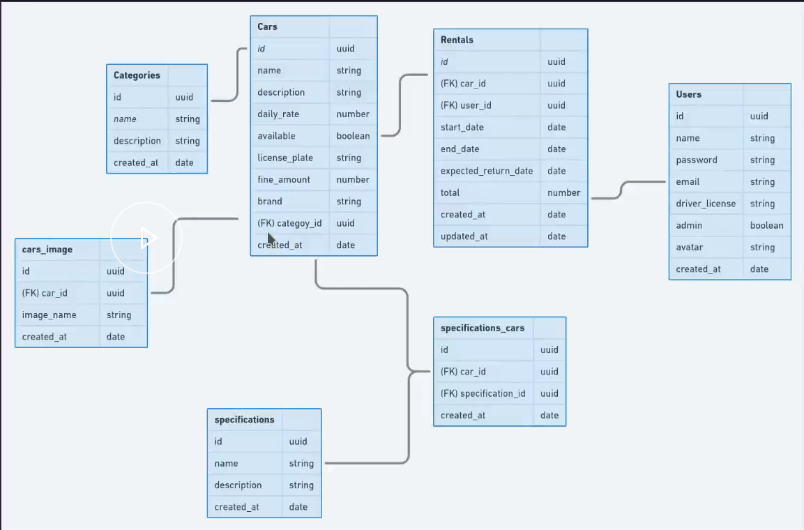

<div align='center'>
    <h1>RentalX</h1>
    <p>RentalX é uma API responsável pela gerenciamento de alugueis de carros. Esse projeto foi construido durante o Bootcamp Ignite da Rocketseat.</p>
</div>

# Descrição

RentalX é uma API que foi construida durante o Bootcamp _Ignite_ da Rocketseat com o objetivo de introduzir os principais conceitos de desenvolvimento de código e as tecnologias mais utilizadas no mercado atualmente no que se diz respeito do desenvolvimento backend com NodeJS.

A ideia é desenvolver uma aplicação que permita o gerenciamento de alugueis de carros, permitindo aos usuários à cadastrar veiculos novos no sistema, informações sobre clientes, permitir o aluguel do carros, receber o carro devolvido, dentro outros.

O desenvolvimento da aplicação se sustenta com base nos princípios da arquitetura limpa e do SOLID. Isso foi algo bastante abordados duantes às aulas é possivel ver sua presença na construção de casos de uso, entidades, e a aplicação do padrão de repositório.

## Diagrama das Entidades



<br>

# Requisitos da Aplicação

## Cadastro de Carro

### Requisitos Funcionais 

- Deve ser possível cadastrar um novo carro.
- Deve ser possível listar todas as categorias.

### Regras de Negócio

- Não deve ser possível cadastrar um carro com uma placa já existente.
- Não deve ser possível alterar a placa de um carro já cadastrado.
- Não deve ser possível cadastrar um carro se o usuário não for administrador.
- Deve se cadastrar um carro com disponibilidade por padrão.

## Listagem de Carros

### Requisito Funcional

- Deve ser possível listar todos os carros disponíveis.
- Deve ser possivel listar todos os carros disponíveis pelo nome da categoria.
- Deve ser possivel listar todos os carros disponíveis pelo nome da marca.
- Deve ser possivel listar todos os carros disponíveis pelo nome do carro (modelo).

### Regra de Negócio

- Deve ser possível listar os carros mesmo se o usuário não estiver logado.

## Cadastro de Especificação no Carro

### Requisitos Funcionais

- Deve ser possivel cadastrar especificações para um carro.
- Deve ser possivel listar todas as especificações.
- Deve ser possível listar todos os carros

### Regras de Negócio

- Não deve ser possivel cadastrar uma especificação para um carro não cadastrado.
- Não deve ser possível cadastrar uma especificação já existente para um mesmo carro.
- Não deve ser possível cadastrar um carro se o usuário não for administrador.

## Cadastro de Imagens do Carro

### Requisitos Funcionais

- Deve ser possível cadastrar a imagem do carro.
- Deve ser possível listar todos os carros, independente da disponibilidade.

### Requisitos Não-Funcionais

- Utilizar o Multer para upload dos arquivos.

### Regras de Negócio

- Não deve ser possível cadastrar uma imagem do carro se o usuário não for administrador.
- Deve ser possível cadastrar mais de uma imagem para um mesmo carro.

## Aluguel de Carro

### Requisito Funcional

- Deve ser possível cadastrar um aluguel.

### Regras de Negócio

- Não deve ser possível cadastrar um aluguel com duração menor que 24 horas.
- Não deve ser possível cadastrar um novo aluguel caso já exista um aberto para um mesmo usuário.
- Não deve ser possível cadastrar um novo aluguel caso já exista um aberto para um mesmo carro.

<br>

# Tecnologias

 - NodeJS
 - Typescript
 - Express
 - ts-node-dev
 - yarn
 - TypeORM
 - Docker
 - eslint
 - prettier

 <br>

# Rodando Código

Atualmente, o projeto está rodando no docker e não possui ainda associação com banco de dados. Portanto, após clonar esse repositório, deve-se criar o container usando o docker-compose antes de rodar a aplicação.

```bash
# Clonar o repositório
$ git clone https://github.com/hereisjohnny2/rentalx.git

# Criar a imagem
$ docker build -t rentalx

# Rodar aplicação em modo de desenvolvimento
$ docker-compose up
```

<br>

# Rotas


## `GET /categories`

Retorna todas as categorias armazenadas no banco de dados se um usuário válido e com  atribuições de administrador está fazendo a solicitação.

## `POST /categories`

Cria uma nova categoria, recebendo o `name` e a `description` dela no corpo da requisição, desde que não seja um `name` já existente. O formato da requisição fica da seguinte forma.

```json
{
    "name": "Nome da Categoria",
    "description": "Descrição da Categoria"
}
```

## `POST /categories/import`

Cria novas categorias com base em um aquivo _.csv_, com os atributos de `name` e `description`. O caminho do arquivo é passado no corpo da requisição e a as categorias são criadas desde que não seja um `name` já existente.
## `GET /specification`

Retorna todas as especificações armazenadas no banco de dados se um usuário válido e com  atribuições de administrador está fazendo a solicitação.

## `POST /specification`

Cria uma nova especificação, recebendo o `name` e a `description` dela no corpo da requisição, desde que não seja um `name` já existente. O formato da requisição fica da seguinte forma.

```json
{
    "name": "Nome da Especificação",
    "description": "Descrição da Especificação"
}
```
